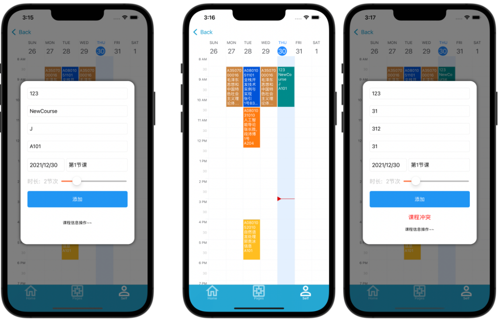
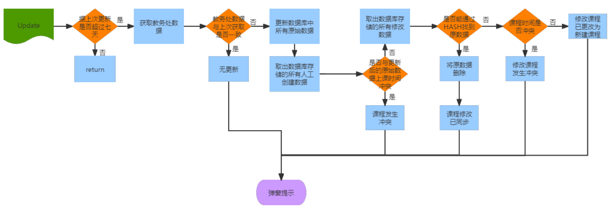
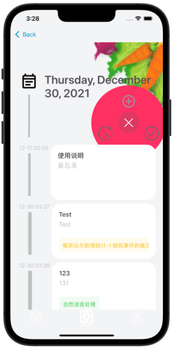
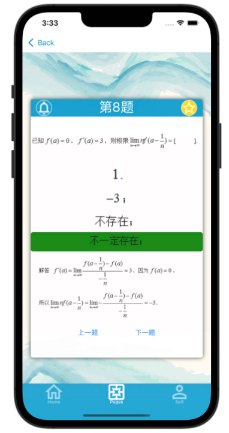

# NEU助手
采用Xamarin技术，基于MVVM+IService构建的Android、IOS端移动应用

基于本产品的核心受众人群，产品共有课程表、备忘录与题库三大核心功能，希望为新生适应大学生活中作业、考试繁多，上课选课自由等特点，减少新生因不适应大学生活而产生的遗忘事项等问题。
## NuGet主要依赖

- ```MvvmLightLibs```
- ```sqlite-net-pcl```
- ```FluentValidation```
- ```Moq```
- ```Newtonsoft.Json```
- ```SharpZipLib```

## 首页展示


## 课程表

### 功能展示
显示相应的课程信息


### 课程表更新流程



## 备忘录



## 刷题
提供题库，同时刷题数据支持同步OneDrive备份


